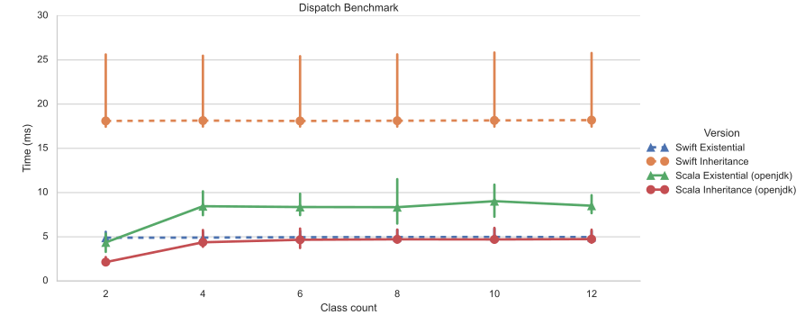

<!-- TODO EPFL, LAMP 
MPLR 2024
-->

## Introduction

Say we have a list of shapes we want to draw

```scala
import lib.shapes.{Shape, Square, Circle}

val shapes: List[Shape] = List(Square(side = 3), Circle(radius = 5))

def drawAll(xs: List[Shape]): Unit =
  for x <- xs do print(x.draw)

drawAll(shapes)
```

## Introduction

```scala
package lib.shapes

abstract class Shape:
  def draw: String

class Square(side: Int) extends Shape:
  def draw = "<rect width="200" height="100" fill="blue" />"

class Circle(radius: Int) extends Shape:
  def draw = s"<circle r="${c.radius}" fill="red" />"
```

## Introduction

```scala
package lib.shapes

abstract class Shape:
  def draw: String

class Square(side: Int) extends Shape:
  def draw = "<rect width="200" height="100" fill="blue" />"

class Circle(radius: Int) extends Shape:
  def draw = s"<circle r="${c.radius}" fill="red" />"
```

What if the shapes library omited the `draw` method?
<!-- we can not make `Drawable` a super trait of the library shapes retroactively.  -->

## Wrapper solution

```scala
abstract class Drawable:
  def draw: String

class DrawableSquare(s: Square) extends Drawable:
  def draw = s"<rect width=${s.side} height=${s.side} fill="blue" />"

class DrawableCircle(c: Circle) extends Drawable:
  def draw = s"<circle r="${c.radius}" fill="red" />"

...

drawAll(DrawableSquare(Square(3)), DrawableCircle(Circle(5)))
```

<!-- Involves tedious boilerplate
- Grows with the number of shapes
- Traits  -->

<!-- But wrapping and unwrapping shapes will obviously not be satisfactorily 

involves tedious boilerplate. 
- wrapping & unwrapping
- each wrappable thing needs a class decl
- each reotractive traits needs new wrappers
  - not to mention their combination (DrawableSerializableSquare)

Involves a runtine cost, possibly even linear if wrapping lists
 -->


##  Type Classes

```scala
trait Drawable[X]:
  def draw(x: X): String

def drawAll[T](witness: Drawable[T])(xs: List[T]): Unit =
  for x <- xs do print(witness.draw(x))
```

##  Type Classes

```scala
trait Drawable[X]:
  def draw(x: X): String

def drawAll[T](witness: Drawable[T])(xs: List[T]): Unit =
  for x <- xs do print(witness.draw(x))

val SquareIsDrawable = new Drawable[Square]:
  def draw(x: X) = 
    s"<rect width=${s.side} height=${s.side} fill="blue" />"

drawAll[Square](List(Square(3), Square(4)))(SquareIsDrawable)
```

<!-- Okay great, but still kinda wordy 
Scala, as most languages which support type class oriented programming, has contextual abs
-->

## Type Classes with Context Parameters

```scala
trait Drawable extends TypeClass:
  extension(self: Self) def draw: String

def drawAll[T: Drawable](xs: List[T]): Unit =
  for x <- xs do print(x.draw)

given Square is Drawable:
  extension(self: Square) def draw = 
    s"<rect width=${s.side} height=${s.side} fill="blue" />"

drawAll(List(Square(3), Square(4)))
```
<!-- no need to explicitly pass + use the witness -->
We got retroactive conformance, usable ergonomically, problem solved!?

## Problem

```scala
given Circle is Shape:
  extension(self: Square) def draw = 
    s"<circle r="${c.radius}" fill="red" />"

drawAll(List(Square(3), Circle(9))) // Type Error
```
<!-- #TODO exact msg -->

Could we amend the `drawAll` definition to accept a heterogenous list of `Shape`s ?

<!-- Rust says yes -->

## Existential Containers as a Language Feature

- Rust has `dyn` traits
- Swift similarly has `any Drawable`

```rust
fn drawAll(xs: Vec<Box<dyn Drawable>>) { ... }
```
<!-- which I am told, you need a box, since `dyn ?` is an unsized type -->

<!-- ```
{ 
  value // of any type of shape
  witness // contains the definition of how to draw the value 
}
``` -->

- So should we add a similar construct to Scala ?

<!-- 
Should we just copy them then, and add yet anoter Scala feature  ?

Or it is really just a pair of: a value, and the body of draw method ?
That is already expressible in Scala?
-->

## Containers of Drawable

```scala
trait AnyDrawable:
  
  val value: ?
  val witness: ?
```

## Containers of Drawable

```scala
trait AnyDrawable:
  
  val value: ?
  val witness: ? is Drawable
```

<!-- Something that is Drawable, a type that is the same as the one of the value -->

## Containers of Drawable

```scala
trait AnyDrawable:
  type Value
  val value: Value
  val witness: Value is Drawable
```

## Containers of Drawable

```scala
trait AnyDrawable:
  type Value
  val value: Value
  val witness: Value is Drawable
```

$$\langle \exists X, (X, \text{X is Drawable}) \rangle$$

## Containers of Drawable

```scala
trait AnyDrawable:
  type Value
  val value: Value
  val witness: Value is Drawable

def drawAll(xs: List[AnyDrawable]): Unit =
  for x <- xs do
    val v: x.Value = x.value
    val w: x.Value is Drawable = x.witness
    print(w.draw(x))
```

## Containers of Drawable

```scala
val s1 = new AnyDrawable:
  type Value = Square
  val value = Square(3)
  val witness = SquareIsDrawable

val s2 = new AnyDrawable:
  type Value = Circle
  val value = Circle(9)
  val witness = CircleIsDrawable

drawAll(List(s1, s2))
```
<!-- But it's wordy, again 😵‍💫 
We started out with the claim that wrapper are bad, 
and now I'm trying to sell you this?!
-->


## Containers of Drawable

::: columns
:::: column
```scala
trait AnyDrawable:
  type Value
  val value: Value
  val witness: Value is Drawable

def drawAll(xs: List[AnyDrawable]): Unit =
  for x <- xs do
    val v: x.Value = x.value
    val w: x.Value is Drawable = x.witness
    print(w.draw(x))
```
::::
:::: column
```scala
trait AnyDrawable:
  type Value: Drawable as witness
  val value: Value


def drawAll(xs: List[AnyDrawable]): Unit =
  for x <- xs do
    val v: x.Value = x.value
    print(v.draw)
 
```
::::
:::

## Containers of Drawable

::: columns
:::: column
```scala
trait AnyDrawable:
  type Value
  val value: Value
  val witness: Value is Drawable

def drawAll(xs: List[AnyDrawable]): Unit =
  for x <- xs do
    val v: x.Value = x.value
    val w: x.Value is Drawable = x.witness
    print(w.draw(x))
```
::::
:::: column
```scala
trait AnyDrawable:
  type Value: Drawable as witness
  val value: Value


def drawAll(xs: List[AnyDrawable]): Unit =
  for x <- xs do print(x.draw)
 

```
::::
:::

## Containers of Drawable

::: columns
:::: column
```scala
val s1 = new AnyDrawable:
  type Value = Square
  val value = Square(3)
  val witness = SquareIsDrawable

val s2 = new AnyDrawable:
  type Value = Circle
  val value = Circle(9)
  val witness = CircleIsDrawable

drawAll(List(s1, s2))
```
::::
:::: column
```scala
object AnyDrawable:
  def apply[V: Drawable](v: V) = 
    new AnyDrawable:
      type Value = V
      val value = v


val s1 = AnyDrawable(Square(1))
val s2 = AnyDrawable(Circle(9))
drawAll(List(s1, s2))
```
::::
:::

## Containers of Drawable

::: columns
:::: column
```scala
val s1 = new AnyDrawable:
  type Value = Square
  val value = Square(3)
  val witness = SquareIsDrawable

val s2 = new AnyDrawable:
  type Value = Circle
  val value = Circle(9)
  val witness = CircleIsDrawable

drawAll(List(s1, s2))
```
::::
:::: column
```scala
object AnyDrawable:
  def apply[V: Drawable](v: V) = 
    new AnyDrawable:
      type Value = V
      val value = v
  
  given [V: Drawable as w] => 
      Conversion[V, AnyDrawable] =
    (x: V) => AnyDrawable(x)(using w)

drawAll(List(Square(1), Circle(9)))
```
::::
:::

<!-- 
Can we generalize ?
 -->

## Generic Containers

::: columns
:::: column
```scala
trait AnyDrawable:
  type Value: Drawable as witness
  val value: Value
```
::::
:::: column
```scala
trait Container[T <: TypeClass]:
  type Value: T as witness
  val value: Value
```
::::
:::

```scala
def drawAll(xs: List[Container[Drawable]]): Unit =
  for x <- xs do print(x.draw)
```

<!-- `T` is a tparam as opposed to type member -->
- No restrictions on the trait `T` used in a Container
<!-- rust requires T to be "object-safe"
e.g. It must not have any associated types with generics.
 -->

- We can generalize further to Containers with 
  - `witness`es of multiple traits
  - `Value`s having upper and/or lower type bounds
<!-- e.g. containers of values upper bounded by shape 
and with witnesses that the value is both drawable, and serilalizable -->


## Soundness for free

```scala
trait Container[T <: TypeClass]:
  type Value: T as witness
  val value: Value
```
- Implemented as library abstraction
- With no changes to the type system
<!-- 3 line change, to omit `.value` -->

- Depedent-Object-Types, the basis of the Scala type system, have been proven sound
- The safety of the encoding is hence an immediate consequence
<!--
But of course, we rely on DOT, which is not trivial itself
 -->

<!-- ## Stable example TODO? -->

## Performance



Time to apply a simple operation (adding the value of a class field to a constant) to 10 million objects in a contiguous array. 
<!-- The operation is modeled using a type class and existential containers in the Existential versions, while it is modeled using a virtual method in the Inheritance version.  -->
<!-- The graph shows the runtime in milliseconds for the 10 million operations, as a function of the number of different object types present in the array.  -->
The error bars show the 99th percentile, while the markers represent the measurement means.

<!--  likely to produce smaller code -->

## Conlusion

We build on established solutions:
- Type Classes: for retroactive conformance, and more
- Existential Containers: for definitions taking collections with heterogeneous conformances

We contribute an implementation of Existential Containers for Scala:
- As a library abstraction
- With no constraints on the type of captured traits
- Usable ergonomically with contextual abstractions
- With some, but reasonable, performance overhead


## Performance Benchmark Programs

```scala
trait C extends TypeClass:
  extension (s: Self) def f(): Double

final class C1(val x: Double)

given C1 is C:
  extension (s: C1) def f(): Double = s.x + 401.0
```

```scala
abstract class C:
  def f(): Double

final class C1(val x: Double) extends C:
  def f(): Double = x + 401.0
```